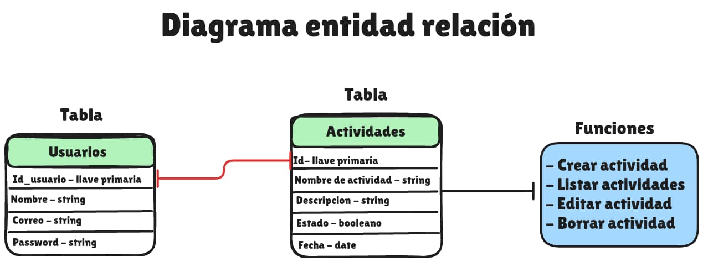
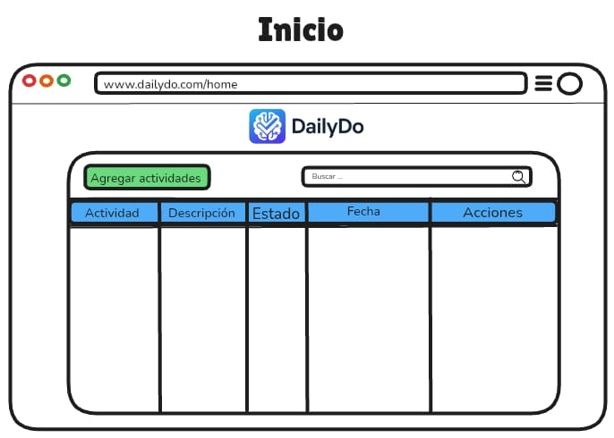
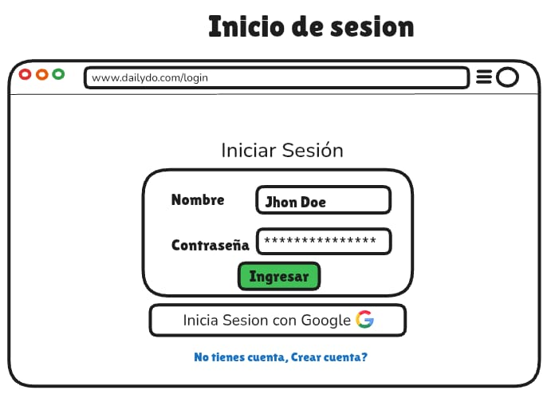
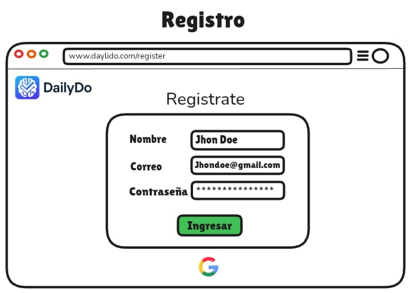

# DailyDo
Proyecto de To-Do desarrollado con Fastapi y sqlite con sqlalchemy 
## Tabla de Contenidos

- [Introducción](#introducción)
- [Diagramas](#diagramas)
  - [Diagrama 1](#diagrama-1)
  - [Diagrama 2](#diagrama-2)
  - [Diagrama 3](#diagrama-3)
  - [Diagrama 4](#diagrama-4)

## Introducción

Desarrollo de una pagina web tipo To-Do usando fastapi y sqlalchemy, aplicacion web para organizar tus actividades diarias 

## Diagramas

### Diagrama 1

*Diagrama entidad relacion de la mini base de datos de este proyecto donde se usa un motor de base de datos sqlite para mayor flexibilidad*

### Diagrama 2

*Mockups de pagina de inicio donde se listaran las tareas y podra tanto modificar como eliminar las tareas*

### Diagrama 3

*Mockups de la pagina de login donde los usuaros podran registrarse*

### Diagrama 4

*Mockups del la pagina de resgitro con la posibilidad de registrarse con google*

